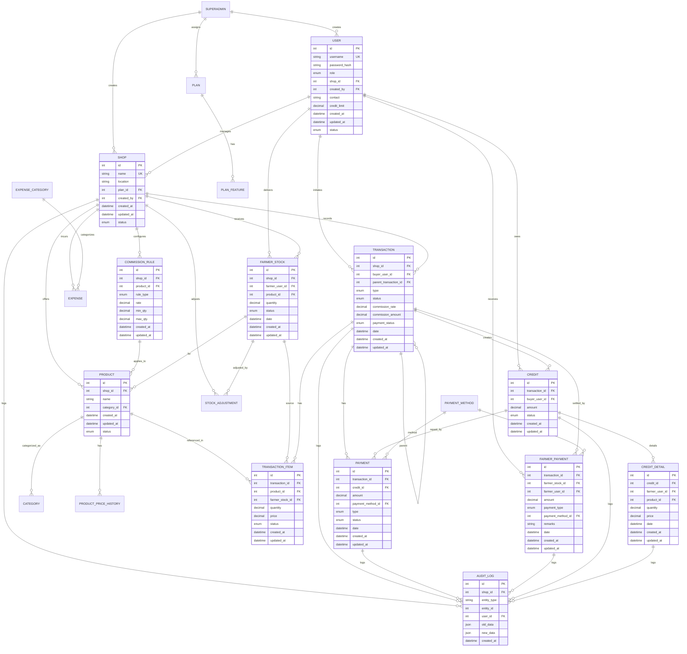
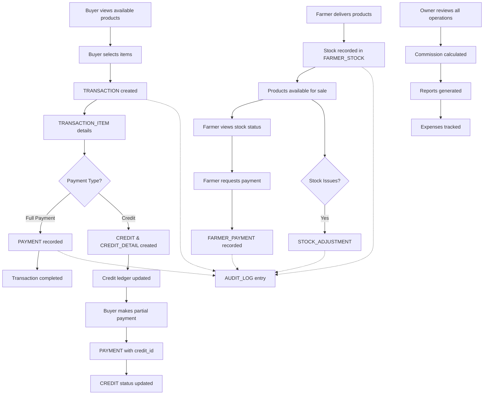

# Market Management System - Entity Relationship Diagram

## 🎯 **ERD Overview**
This document contains the core Entity Relationship Diagram for the Market Management System, showing the relationships between all entities and their key attributes.

**📋 Related Documentation:**
- [Database Schema](./Database_Schema.md) - Complete SQL table definitions
- [Business Rules](./Business_Rules.md) - Business logic and validation rules  
- [System Architecture](./System_Architecture.md) - Technology stack and architecture
- [API Specification](./API_Specification.md) - REST API endpoints

---

## Entity Relationship Diagram



---

## System Workflow Overview

### Complete Business Process Flow


---

## Core Entity Relationships Explained

### 1. **User Management Hierarchy**
- **SUPERADMIN** creates and manages **SHOP** entities
- **USER** entities have roles (owner, farmer, buyer, employee, guest)
- Each **USER** is associated with a **SHOP** (except guests)

### 2. **Stock Management Flow**
- **FARMER_STOCK** tracks farmer deliveries per product
- **TRANSACTION_ITEM** references specific **FARMER_STOCK** entries
- **STOCK_ADJUSTMENT** handles corrections and modifications

### 3. **Transaction & Payment Architecture**
- **TRANSACTION** can have multiple **TRANSACTION_ITEM** entries
- **PAYMENT** can be linked to **TRANSACTION** (direct) or **CREDIT** (repayment)
- **FARMER_PAYMENT** handles farmer settlements and advances

### 4. **Credit Management System**
- **CREDIT** tracks buyer's total outstanding amount
- **CREDIT_DETAIL** breaks down credit per farmer and product
- Multiple **PAYMENT** entries can settle one **CREDIT**

### 5. **Audit & Compliance**
- **AUDIT_LOG** captures all critical data changes
- JSON fields store old and new data states
- Complete traceability for regulatory compliance

---

## Key Business Rules Reflected in ERD

### 1. **Multi-Tenant Design**
- All core entities linked to **SHOP** for data isolation
- **SUPERADMIN** has cross-shop access capabilities

### 2. **Flexible Payment Models**
- Support for full payments, partial payments, and credit
- Advance payments to farmers before stock delivery
- Commission tracking per transaction

### 3. **Stock Lifecycle Management**
- Stock status progression: active → closed/returned/discarded
- Adjustment capabilities for corrections
- Historical tracking of all stock movements

### 4. **Credit Management**
- Per-buyer credit limits with real-time validation
- Detailed breakdown of credit per farmer
- Flexible repayment with partial payment support

---

## 📋 **ERD Implementation Notes**

### Database Constraints
- **Foreign Key Constraints**: Ensure data integrity across relationships
- **Check Constraints**: Validate enum values and business rules
- **Unique Constraints**: Prevent duplicate usernames and shop names
- **Not Null Constraints**: Enforce required fields

### Performance Considerations
- **Indexes**: Strategic indexing on frequently queried columns
- **Partitioning**: Consider partitioning AUDIT_LOG by date
- **Materialized Views**: For complex aggregations and reporting

### Scalability Features
- **JSON Fields**: Future-proof for additional attributes
- **Soft Deletes**: Status-based record management
- **Audit Trail**: Complete change tracking for compliance

This ERD serves as the foundational blueprint for the Market Management System, ensuring all business relationships are properly modeled and data integrity is maintained across all operations.
```


