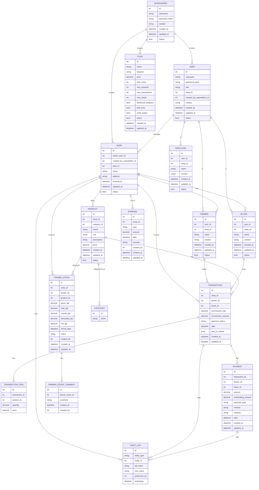
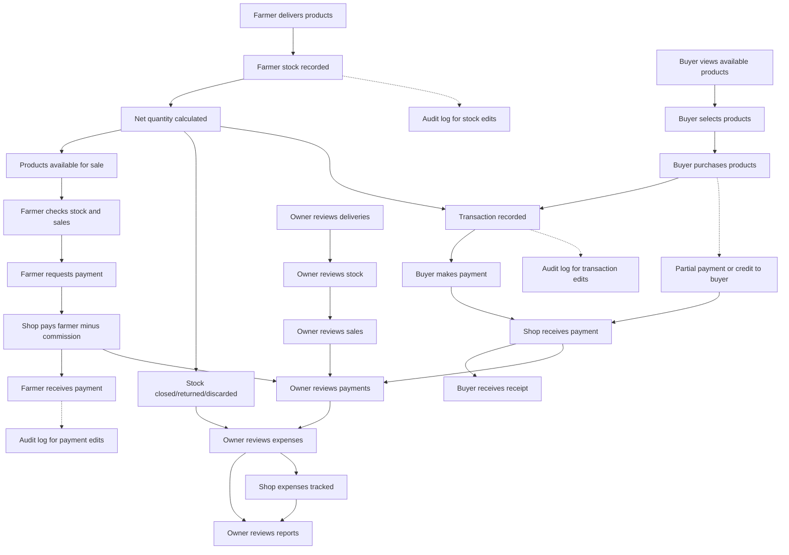

# Entity Relationship Diagram (ERD) - Market Management System (Mermaid, Best Practices)

---

# Owner Workflow Diagram (Mermaid)

---

# Reference Tables & ENUMs Documentation

## Reference Tables

- **CATEGORY**: Product types (e.g., flower, vegetable, fruit, grain, etc.)
- **PAYMENT_METHOD**: Payment options (e.g., cash, online, upi, card, cheque, etc.)
- **PLAN**: Subscription or service tiers (e.g., basic, premium, enterprise)

## ENUM Fields

- **USER.role**: 'owner', 'farmer', 'buyer', 'employee'
- **USER.status**: 'active', 'inactive', 'suspended'
- **EXPENSE.type**: 'wage', 'rent', 'utility', 'other'
- **TRANSACTION.type**: 'sale', 'return', 'exchange'
- **TRANSACTION.status**: 'pending', 'completed', 'cancelled'
- **FARMER_STOCK.status**: 'active', 'closed', 'discarded', 'returned'
- **PAYMENT.type**: 'full', 'partial', 'credit'
- **PAYMENT.status**: 'pending', 'completed', 'failed', 'refunded'

## Usage Notes

- Reference tables (CATEGORY, PAYMENT_METHOD, PLAN) should be used for normalization and reporting.
- ENUM fields should be implemented as database ENUM types or validated in application logic for consistency.
- Foreign keys should link entities to reference tables for integrity and easy filtering.

This documentation ensures all types and options are standardized and future-proofed for implementation.
