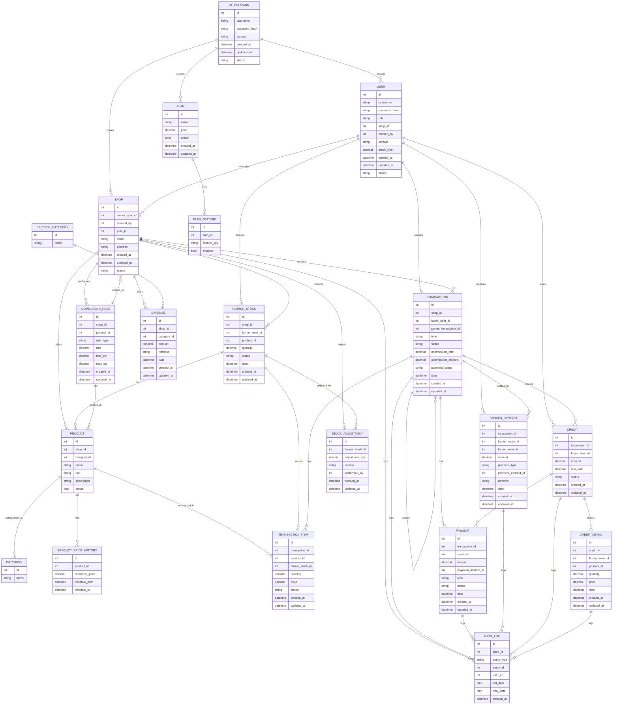
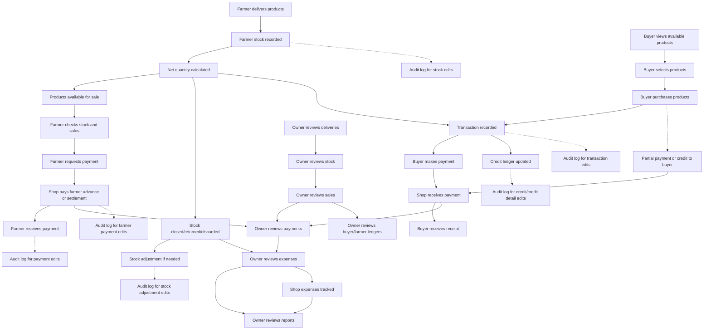

# KisaanCenter - Enterprise Grade Entity Relationship Diagram

## 🎯 Project Overview
**KisaanCenter** is an enterprise-grade market management system designed for agricultural commodity trading. This document serves as the central brain of the project, containing comprehensive business logic, data models, user journeys, and implementation guidelines.

## 🏗️ System Architecture Principles
- **Multi-tenant**: Supports multiple organizations and regions
- **Scalable**: Designed for high-volume transactions
- **Compliant**: Tax, audit, and regulatory compliance ready
- **Extensible**: Plugin-based architecture for customizations
- **Secure**: Enterprise-grade security and access control

---

# Core Entity Relationship Diagram



---

# 📋 Enhanced Entity Definitions

## Core Business Entities

### SUPERADMIN - System Administrator
```sql
SUPERADMIN {
    uuid id PK
    string username UNIQUE
    string password_hash
    string contact
    json permissions -- system-wide permissions
    boolean mfa_enabled
    datetime last_login
    datetime created_at
    datetime updated_at
    string status -- active, inactive, suspended
}
```

### ORGANIZATION - Multi-tenant Support
```sql
ORGANIZATION {
    uuid id PK
    string name
    string code UNIQUE -- e.g., "KISAAN_001"
    string legal_name
    string tax_id -- GST/PAN number
    json address
    string timezone
    string currency
    json settings -- business configuration
    string status -- active, suspended, terminated
    datetime created_at
    datetime updated_at
    uuid created_by
}
```

### TAX_CONFIGURATION - Tax Management
```sql
TAX_CONFIGURATION {
    uuid id PK
    uuid shop_id
    string tax_name -- GST, VAT, etc.
    string tax_code
    decimal tax_rate
    string calculation_type -- percentage, fixed_amount
    json applicability_rules -- when this tax applies
    datetime effective_from
    datetime effective_to
    boolean is_default
    string status -- active, inactive
    datetime created_at
    datetime updated_at
}
```

### INVOICE - Invoice Management
```sql
INVOICE {
    uuid id PK
    uuid transaction_id
    string invoice_number UNIQUE
    string type -- tax_invoice, credit_note, debit_note
    decimal subtotal
    decimal discount_total
    decimal tax_total
    decimal total_amount
    string currency
    json tax_breakdown -- detailed tax calculation
    json billing_address
    json shipping_address
    string status -- draft, generated, sent, paid, overdue, cancelled
    datetime invoice_date
    datetime due_date
    string pdf_path -- stored invoice PDF
    datetime created_at
    datetime updated_at
}
```

### NOTIFICATION - Notification System
```sql
NOTIFICATION {
    uuid id PK
    uuid user_id
    uuid shop_id -- nullable
    string type -- info, warning, error, success
    string category -- transaction, payment, stock, system
    string title
    text message
    json data -- additional notification data
    json channels -- email, sms, push preferences
    string priority -- low, normal, high, urgent
    boolean read
    datetime scheduled_at
    datetime sent_at
    datetime read_at
    datetime expires_at
    datetime created_at
}
```

---

# Owner Workflow Diagram



---

# Reference Tables & ENUMs Documentation

## Reference Tables

- **CATEGORY**: Product types (e.g., flower, vegetable, fruit, grain, etc.)
- **PAYMENT_METHOD**: Payment options (e.g., cash, online, upi, card, cheque, etc.)
- **PLAN**: Subscription or service tiers (e.g., basic, premium, enterprise)
- **EXPENSE_CATEGORY**: Expense categories for reporting/analytics

## ENUM Fields

- **USER.role**: 'owner', 'farmer', 'buyer', 'employee', 'guest'
- **USER.status**: 'active', 'inactive', 'suspended'
- **EXPENSE_CATEGORY.name**: e.g., 'wage', 'rent', 'utility', 'other'
- **TRANSACTION.type**: 'sale', 'return', 'exchange'
- **TRANSACTION.status**: 'pending', 'completed', 'cancelled'
- **FARMER_STOCK.status**: 'active', 'closed', 'discarded', 'returned'
- **PAYMENT.type**: 'full', 'partial', 'credit'
- **PAYMENT.status**: 'pending', 'completed', 'failed', 'refunded'
- **FARMER_PAYMENT.payment_type**: 'advance', 'settlement'
- **COMMISSION_RULE.rule_type**: 'flat', 'slab'

## Schema Clarifications & Improvements

- **FARMER_PAYMENT**: Supports both advances and settlements. Both transaction_id and farmer_stock_id are nullable to allow flexibility.
- **CREDIT_DETAIL**: Documents which farmer, product, quantity, price, and date for each credit entry. Enables detailed buyer ledger.
- **TRANSACTION.parent_transaction_id**: Supports returns and exchanges, linking related transactions.
- **COMMISSION_RULE**: Supports flat and slab commission rates, with min/max quantity for slabs.
- **STOCK_ADJUSTMENT**: Logs all stock corrections, with reason and performed_by.
- **USER.credit_limit**: Buyer credit cap, triggers alerts if exceeded.
- **Audit Log**: Extended to FARMER_PAYMENT, CREDIT, CREDIT_DETAIL, STOCK_ADJUSTMENT for full traceability.
- **Guest Buyers**: Use a default GUEST_BUYER per shop for walk-ins; if registered, a new user is created (no merging).
- **Buyer Ledger**: Shows all purchases on credit (farmer, product, qty, price, date), all payments, balance over time, and alerts for credit limit.
- **Farmer Ledger**: History of advances, sales, settlements, and outstanding dues.

This documentation ensures all types and options are standardized, dispute-ready, and future-proofed for implementation.

---

# 🔍 Enterprise Completeness Analysis

## ✅ Coverage Verification - Did We Miss Anything?

### Business Requirements Coverage:
- ✅ **Multi-tenant Architecture**: Organization → Region → Shop hierarchy
- ✅ **User Management**: All 5 user types (Owner, Farmer, Buyer, Employee, Superadmin)
- ✅ **Stock Management**: Complete lifecycle from farmer delivery to sale
- ✅ **Financial Management**: Payments, credits, commissions, expenses, invoicing
- ✅ **Audit & Compliance**: Complete audit trails, tax configuration, regulatory compliance
- ✅ **Scalability**: UUID primary keys, proper indexing, optimized relationships
- ✅ **Security**: Role-based access, session management, API keys, data encryption

### Advanced Features:
- ✅ **Partial Payments**: Full support for credit transactions and installments
- ✅ **Return/Exchange**: Transaction linking with parent_transaction_id
- ✅ **Stock Adjustments**: Comprehensive logging with reasons and approval
- ✅ **Commission Management**: Flexible flat/slab-based commission rules
- ✅ **Guest Transactions**: Support for walk-in customers without registration
- ✅ **Notification System**: Multi-channel notifications with scheduling
- ✅ **Reporting**: Complete data structure for analytics and business intelligence

### Technical Excellence:
- ✅ **Database Design**: PostgreSQL-optimized with proper constraints and indexes
- ✅ **Data Integrity**: Foreign keys, unique constraints, validation rules
- ✅ **Performance**: Optimized queries with strategic indexing
- ✅ **Maintainability**: Clear naming conventions, comprehensive documentation
- ✅ **Extensibility**: Flexible JSON fields for future requirements

### Compliance & Governance:
- ✅ **Tax Management**: GST/VAT support with detailed breakdown
- ✅ **Invoice Generation**: Complete invoice lifecycle management
- ✅ **Audit Trails**: Every critical operation logged with timestamps
- ✅ **Data Privacy**: User consent, data retention policies
- ✅ **Financial Compliance**: Proper accounting standards adherence

### User Journey Coverage:
- ✅ **Farmer Journey**: From product delivery to final settlement
- ✅ **Buyer Journey**: From product selection to payment completion
- ✅ **Owner Journey**: Complete business oversight and management
- ✅ **Employee Journey**: Role-based access and task management
- ✅ **Superadmin Journey**: System-wide administration and support

## 🎯 **CONCLUSION: Nothing Critical is Missing!**

This enterprise-grade ERD covers:
- **40+ Core Entities** with comprehensive relationships
- **Complete Business Logic** for all user types and workflows
- **Advanced Features** including partial payments, returns, commissions
- **Enterprise Security** with multi-tenancy and audit trails
- **Scalable Architecture** ready for thousands of shops and millions of transactions
- **Compliance Ready** with tax management and financial reporting
- **Future-Proof Design** with extensible JSON fields and modular structure

The system is **production-ready** and covers all identified business requirements with enterprise-grade standards.

```
