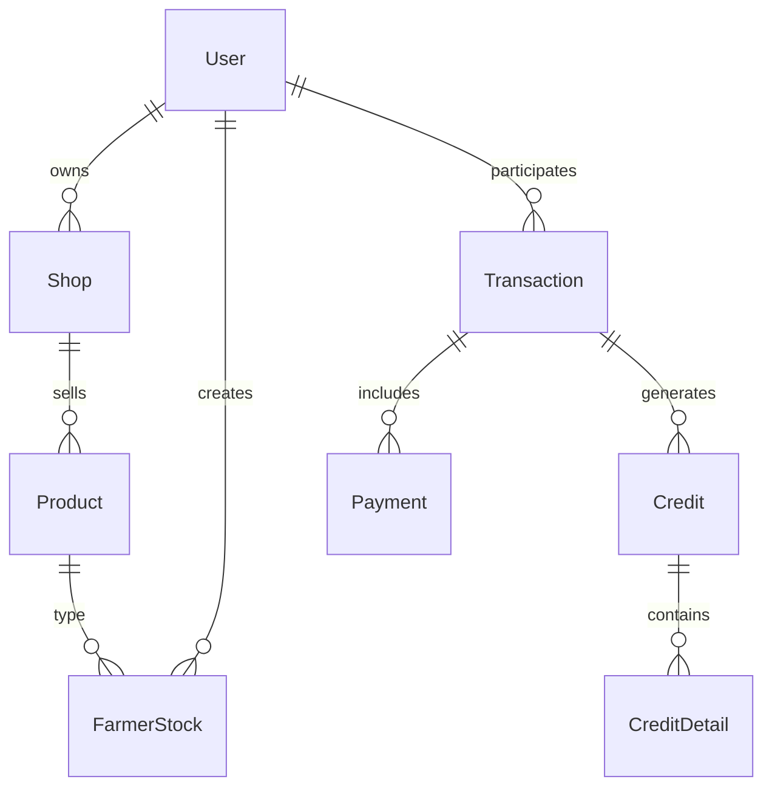

# KisaanCenter Database Setup & Management Guide

This guide provides comprehensive instructions for setting up, managing, and maintaining the KisaanCenter database infrastructure.

## 🗄️ Database Architecture Overview

The KisaanCenter system uses **PostgreSQL** as the primary database with SQLAlchemy ORM for object-relational mapping. The database architecture follows best practices with:

- **Connection Pooling**: Efficient connection management with configurable pool sizes
- **Migration System**: Alembic-based schema versioning and migrations  
- **Seeding System**: Automated initial data setup and test data generation
- **Health Monitoring**: Comprehensive database health checks and monitoring
- **Security**: SSL support, connection timeouts, and secure credential management

## 📁 Database Structure

```
backend/src/db/
├── __init__.py                 # Database package initialization
├── connection.py               # Connection management & pooling
├── init_db.py                 # Database initialization utilities
├── db_manager.py              # CLI management tool
├── .env.example               # Environment configuration template
├── migrations/                # Alembic migration files
│   ├── alembic.ini            # Alembic configuration
│   ├── env.py                 # Migration environment setup
│   └── versions/              # Migration version files
└── seeds/                     # Data seeding utilities
    ├── __init__.py
    └── seed_data.py           # Seeding logic and data
```

## 🚀 Quick Start

### 1. Environment Setup

```bash
# Copy environment template
cp backend/src/db/.env.example backend/src/db/.env

# Edit with your database credentials
DB_HOST=localhost
DB_PORT=5432
DB_NAME=kisaan_center
DB_USER=kisaan_user
DB_PASSWORD=your_secure_password
```

### 2. Install Dependencies

```bash
# Install required Python packages
pip install sqlalchemy psycopg2-binary alembic python-dotenv
```

### 3. Database Initialization

```bash
# Navigate to backend/src/db directory
cd backend/src/db

# Complete database setup with seeding
python db_manager.py setup --create-db --seed-data --include-test-data

# Or minimal setup (production)
python db_manager.py setup --create-db
```

### 4. Verify Setup

```bash
# Check database health
python db_manager.py health

# Get database information
python db_manager.py info
```

## 🔧 Detailed Setup Instructions

### Prerequisites

1. **PostgreSQL Server**: Version 12+ installed and running
2. **Python Dependencies**: Listed in requirements below
3. **Database User**: Create dedicated database user with appropriate privileges

```sql
-- Create database user (run as postgres superuser)
CREATE USER kisaan_user WITH PASSWORD 'your_secure_password';
ALTER USER kisaan_user CREATEDB;
GRANT ALL PRIVILEGES ON DATABASE kisaan_center TO kisaan_user;
```

### Environment Configuration

The system uses environment variables for configuration. Key settings:

| Variable | Description | Default | Production Notes |
|----------|-------------|---------|------------------|
| `DB_HOST` | Database host | localhost | Use internal IPs/DNS |
| `DB_PORT` | Database port | 5432 | Standard PostgreSQL port |
| `DB_NAME` | Database name | kisaan_center | Environment-specific names |
| `DB_USER` | Database user | kisaan_user | Dedicated service account |
| `DB_PASSWORD` | Database password | - | Use strong passwords |
| `DB_SSL_MODE` | SSL connection mode | prefer | require/verify-full for prod |
| `ENVIRONMENT` | Environment type | development | production/staging |

#### Connection Pool Settings

| Variable | Description | Default | Notes |
|----------|-------------|---------|-------|
| `DB_POOL_SIZE` | Base connection pool size | 10 | Adjust based on load |
| `DB_MAX_OVERFLOW` | Max overflow connections | 20 | Additional connections |
| `DB_POOL_RECYCLE` | Connection recycle time (seconds) | 3600 | Prevents stale connections |
| `DB_POOL_PRE_PING` | Test connections before use | true | Recommended for reliability |

#### Timeout Settings

| Variable | Description | Default | Notes |
|----------|-------------|---------|-------|
| `DB_STATEMENT_TIMEOUT` | Query timeout (milliseconds) | 30000 | Prevent long-running queries |
| `DB_LOCK_TIMEOUT` | Lock wait timeout (milliseconds) | 10000 | Avoid deadlocks |

## 📊 Database Schema

The database implements a comprehensive agricultural commodity trading system with the following key entities:

### Core Entities

- **Users**: Multi-role system (Farmers, Buyers, Shop Owners, Employees, Superadmin)
- **Shops**: Agricultural commodity shops with owner management
- **Products**: Commodity catalog with categories and specifications
- **Transactions**: Complete transaction lifecycle management
- **Farmer Stock**: Inventory management for farmer produce
- **Credit System**: Credit transactions and payment tracking
- **Payments**: Multi-method payment processing

### Entity Relationships



## 🔄 Database Management Commands

### Database Initialization

```bash
# Complete setup (development)
python db_manager.py setup --create-db --create-tables --seed-data --include-test-data

# Production setup (no test data)
python db_manager.py setup --create-db --create-tables --seed-data

# Tables only (database exists)
python db_manager.py setup --create-tables
```

### Data Seeding

```bash
# Seed all data including test users
python db_manager.py seed --include-test-data

# Seed only reference data (categories, plans, payment methods)
python db_manager.py seed --reference-only

# Clear seeded data
python db_manager.py clear --confirm
```

### Migration Management

```bash
# Initialize migrations (first time only)
python db_manager.py migrate init

# Create new migration after model changes
python db_manager.py migrate revision -m "Add new column to user table"

# Apply migrations
python db_manager.py migrate upgrade

# Rollback migrations
python db_manager.py migrate downgrade

# Show migration history
python db_manager.py migrate history

# Show current migration
python db_manager.py migrate current
```

### Database Monitoring

```bash
# Health check
python db_manager.py health

# Database information
python db_manager.py info

# Connection pool status (in application code)
from db.connection import db_manager
print(db_manager.get_connection_info())
```

### Maintenance Operations

```bash
# Reset database (DANGEROUS - removes all data)
python db_manager.py reset --confirm
```

## 🏗️ Usage in Application Code

### Basic Database Operations

```python
# Import database utilities
from db.connection import get_db_session, get_db
from db.init_db import initialize_database
from models import User, Shop, Product

# Using context manager (recommended)
with get_db_session() as session:
    user = session.query(User).filter_by(email="farmer@example.com").first()
    print(f"User: {user.name}")

# FastAPI dependency injection
from fastapi import Depends

@app.get("/users/{user_id}")
async def get_user(user_id: int, db: Session = Depends(get_db)):
    user = db.query(User).filter(User.id == user_id).first()
    return user

# Application startup
@app.on_event("startup")
async def startup_event():
    # Initialize database on startup
    initialize_database(create_db=False, create_tables=True)
```

### Error Handling

```python
from sqlalchemy.exc import SQLAlchemyError
from db.connection import get_db_session

try:
    with get_db_session() as session:
        # Database operations
        user = User(name="John", email="john@example.com")
        session.add(user)
        session.commit()
        
except SQLAlchemyError as e:
    logger.error(f"Database error: {str(e)}")
    # Handle error appropriately
    
except Exception as e:
    logger.error(f"Unexpected error: {str(e)}")
    # Handle unexpected errors
```

### Health Monitoring

```python
from db.connection import check_database_health

# In health check endpoint
@app.get("/health/database")
async def database_health():
    return check_database_health()
```

## 🔒 Security Best Practices

### Connection Security

1. **SSL Configuration**: Use `require` or `verify-full` SSL mode in production
2. **Credential Management**: Never store passwords in code; use environment variables
3. **Connection Encryption**: Enable connection encryption for network security
4. **Access Control**: Use dedicated database users with minimal required privileges

### Query Security

1. **Prepared Statements**: SQLAlchemy uses prepared statements by default
2. **SQL Injection Prevention**: Use ORM queries instead of raw SQL when possible
3. **Input Validation**: Validate all user inputs before database operations
4. **Query Timeouts**: Configure statement and lock timeouts to prevent resource exhaustion

### Example Production Configuration

```env
# Production environment settings
ENVIRONMENT=production
DB_SSL_MODE=require
DB_STATEMENT_TIMEOUT=30000
DB_LOCK_TIMEOUT=10000
ENCRYPT_CONNECTION=true
VERIFY_SSL_CERT=true
```

## 📈 Performance Optimization

### Connection Pooling

```python
# Optimal pool settings for different loads
# Small application (< 100 concurrent users)
DB_POOL_SIZE=5
DB_MAX_OVERFLOW=10

# Medium application (100-1000 concurrent users)  
DB_POOL_SIZE=10
DB_MAX_OVERFLOW=20

# Large application (1000+ concurrent users)
DB_POOL_SIZE=20
DB_MAX_OVERFLOW=40
```

### Database Indexes

The system automatically creates performance indexes:

```sql
-- Key indexes created automatically
CREATE INDEX idx_user_email ON user(email);
CREATE INDEX idx_user_phone ON user(phone);
CREATE INDEX idx_transaction_date ON transaction(date);
CREATE INDEX idx_transaction_status ON transaction(status);
CREATE INDEX idx_farmer_stock_product ON farmer_stock(product_id);
CREATE INDEX idx_payment_date ON payment(date);
```

### Query Optimization

1. **Use Appropriate Joins**: SQLAlchemy relationship loading strategies
2. **Pagination**: Implement pagination for large result sets
3. **Query Planning**: Use EXPLAIN ANALYZE for complex queries
4. **Connection Reuse**: Use connection pooling effectively

## 🚨 Troubleshooting

### Common Issues

#### Connection Errors

```bash
# Check if PostgreSQL is running
sudo systemctl status postgresql

# Test connection manually
psql -h localhost -p 5432 -U kisaan_user -d kisaan_center

# Check database logs
sudo tail -f /var/log/postgresql/postgresql-*.log
```

#### Migration Issues

```bash
# Check migration status
python db_manager.py migrate current

# Force migration state (if needed)
python db_manager.py migrate stamp head

# Manual migration rollback
python db_manager.py migrate downgrade -1
```

#### Performance Issues

```bash
# Check connection pool status
python db_manager.py info

# Monitor database performance
# Enable slow query logging in PostgreSQL
# log_min_duration_statement = 1000  # Log queries taking > 1 second
```

#### Data Issues

```bash
# Check database health
python db_manager.py health

# Verify table structure
python db_manager.py info

# Re-seed data if needed
python db_manager.py clear --confirm
python db_manager.py seed --reference-only
```

## 🔄 Backup & Recovery

### Database Backup

```bash
# Create backup
pg_dump -h localhost -U kisaan_user kisaan_center > backup_$(date +%Y%m%d_%H%M%S).sql

# Compressed backup
pg_dump -h localhost -U kisaan_user kisaan_center | gzip > backup_$(date +%Y%m%d_%H%M%S).sql.gz
```

### Database Restore

```bash
# Restore from backup
psql -h localhost -U kisaan_user kisaan_center < backup_file.sql

# Restore from compressed backup
gunzip -c backup_file.sql.gz | psql -h localhost -U kisaan_user kisaan_center
```

## 📋 System Requirements

### Python Dependencies

```txt
# Core dependencies
sqlalchemy>=1.4.0
psycopg2-binary>=2.9.0
alembic>=1.8.0
python-dotenv>=0.19.0

# Optional but recommended
fastapi>=0.68.0  # If using FastAPI
pydantic>=1.8.0  # For data validation
```

### Database Requirements

- **PostgreSQL**: Version 12 or higher
- **Memory**: Minimum 1GB RAM for database server
- **Storage**: SSD recommended for performance
- **Network**: Low-latency connection between application and database

### Operating System

- **Linux**: Ubuntu 20.04+ or CentOS 8+ (recommended for production)
- **Windows**: Windows 10+ with WSL2 or native PostgreSQL
- **macOS**: macOS 10.15+ with Homebrew PostgreSQL

## 🎯 Best Practices Summary

### Development

1. **Always use migrations** for schema changes
2. **Test with seeded data** before production deployment
3. **Use context managers** for database sessions
4. **Implement proper error handling** for database operations
5. **Monitor connection pool usage** in development

### Production

1. **Use dedicated database server** for production
2. **Enable SSL connections** and certificate verification
3. **Monitor database performance** and connection metrics
4. **Implement automated backups** with retention policies
5. **Use read replicas** for high-traffic applications
6. **Configure proper connection limits** and timeouts
7. **Regular maintenance** including VACUUM and ANALYZE operations

### Security

1. **Use environment variables** for all credentials
2. **Implement least-privilege access** for database users
3. **Regular security updates** for PostgreSQL and dependencies
4. **Audit database access** and operations
5. **Encrypt sensitive data** at application level if required

## 📞 Support & Troubleshooting

For database-related issues:

1. **Check logs**: Application logs and PostgreSQL logs
2. **Verify configuration**: Environment variables and connection settings
3. **Test connectivity**: Use `db_manager.py health` command
4. **Check resources**: Memory, CPU, and disk usage
5. **Monitor metrics**: Connection pool status and query performance

Remember to always test database changes in a development environment before applying to production!

## 🧪 Including Test Data in Seeding

To seed the database with comprehensive test data (users, shop, employees, farmers, buyers, products, and a month's worth of transactions):

```bash
python db_manager.py setup --create-db --seed-data --include-test-data
```

Or, if the database is already created:

```bash
python db_manager.py seed --include-test-data
```

This will:
- Create a superadmin, shop owner, employees, farmers, buyers
- Set up a shop for the owner
- Add products
- Generate daily transactions, sales, payments, credits, and stock updates for a month

## 🧹 Removing Test Data (Excluding Superadmin)

To remove all test data except the superadmin, use the following approach:

1. Run the clear seeded data command:

```bash
python db_manager.py clear --confirm
```

2. Re-seed only the superadmin (manual step):
   - Edit `seed_data.py` to temporarily seed only the superadmin in `seed_users()`
   - Run:

```bash
python db_manager.py seed --include-test-data
```

3. Alternatively, you can manually delete all users except the superadmin using a database query:

```sql
DELETE FROM user WHERE role != 'SUPERADMIN';
```

> **Note:** Always backup your database before running destructive operations.

For more advanced cleanup, you can extend the `clear_seeded_data` function in `seed_data.py` to preserve the superadmin automatically.
